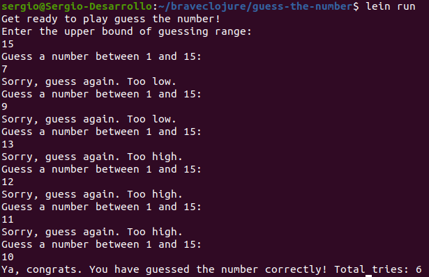
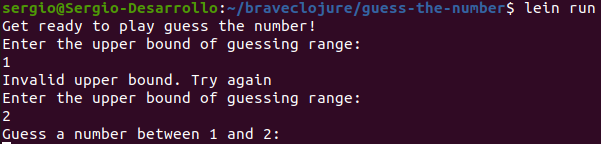
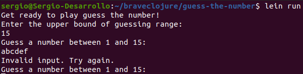

# guess-the-number

Simple guessing game implemented in Clojure.

## Normal operation

## Upper bound validation

Upper bound must be greater than 1

## Guess validations

Guess must be a valid number (no letters or empty)

